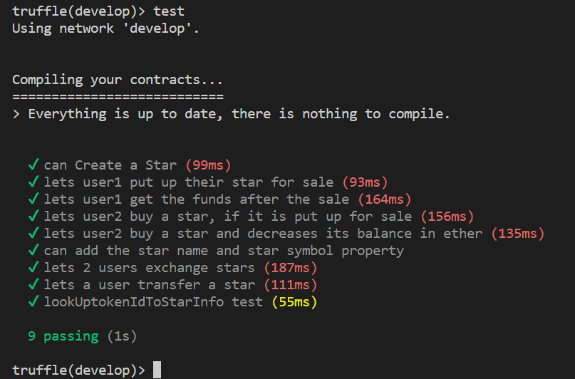
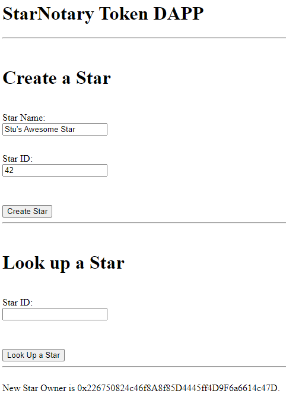
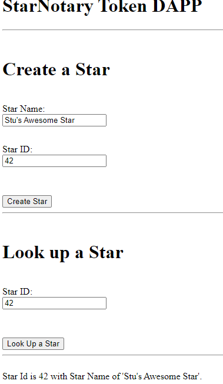

# ND1309 C2 Ethereum Smart Contracts, Tokens and Dapps - Project Starter 
**PROJECT: Decentralized Star Notary Service Project** - For this project, you will create a DApp by adding functionality with your smart contract and deploy it on the public testnet.

**Solution** - This repo constains my implementation of the taks defined below.

1. Task 1 - Your Project is to Modify the StarNotary version 2 contract code to achieve the following:
    * Add a name and a symbol for your starNotary tokens. Resource
    * Add a function lookUptokenIdToStarInfo, that looks up the stars using the Token ID, and then returns the name of the star.
    * Add a function called exchangeStars, so 2 users can exchange their star tokens...Do not worry about the price, just write code to exchange stars between users.
    * Write a function to Transfer a Star. The function should transfer a star from the address of the caller. The function should accept 2 arguments, the address to transfer the star to, and the token ID of the star.

2. Task 2 - Add supporting unit tests, to test the following:
    * The token name and token symbol are added properly.
    * 2 users can exchange their stars.
    * Stars Tokens can be transferred from one address to another.

3. Task 3 - Deploy your Contract to Rinkeby
    * Edit the truffle.config file to add settings to deploy your contract to the Rinkeby Public Network.
    * Helper Points: 
      * Command used to deploy to Rinkeby `truffle migrate --reset --network rinkeby`
      * You will need to have your Metamask’s seed and Infura setup.

      **NOTE:** Rinkeby is depricated in Infura, using the Goerli network instead. `truffle migrate --reset --network goerli`

4. Task 4 - Modify the front end of the DAPP to achieve the following:
    * Lookup a star by ID using tokenIdToStarInfo() (you will have to add code for this in your index.html and index.js files)

### Public Network Deployment and Versions
| Key | Value |
|---|---|
| ERC-721 Token Name | Udacity Star Notary |
| ERC-721 Token Symbol| USN |
| Goerli Network Contract Address | 0x5F850134D511a482EdEF9Cb2F6b087A6DF1ca66F [link](https://goerli.etherscan.io/address/0x5f850134d511a482edef9cb2f6b087a6df1ca66f)|
| Truffle | v5.7.1 (core: 5.7.1) |
| Ganache | v7.6.0 |
| Solidity | v0.5.16 (solc-js) |
| Node | v16.19.0 |
| Web3.js | v1.8.1 |
| OpenZeppelin | v2.3 | 

### Dependencies
For this project, you will need to have:
1. **Node and NPM** installed - NPM is distributed with [Node.js](https://www.npmjs.com/get-npm)
```bash
# Check Node version
node -v
# Check NPM version
npm -v
```


2. **Truffle v5.X.X** - A development framework for Ethereum. 
```bash
# Unsinstall any previous version
npm uninstall -g truffle
# Install
npm install -g truffle
# Specify a particular version
npm install -g truffle@5.0.2
# Verify the version
truffle version
```


2. **Metamask: 5.3.1** - If you need to update Metamask just delete your Metamask extension and install it again.


3. [Ganache](https://www.trufflesuite.com/ganache) - Make sure that your Ganache and Truffle configuration file have the same port.


4. **Other mandatory packages**:
```bash
cd app
# install packages
npm install --save  openzeppelin-solidity@2.3
npm install --save  truffle-hdwallet-provider@1.0.17
npm install webpack-dev-server -g
npm install web3
```


### Run the application
1. Clean the frontend 
```bash
cd app
# Remove the node_modules  
# remove packages
rm -rf node_modules
# clean cache
npm cache clean
rm package-lock.json
# initialize npm (you can accept defaults)
npm init
# install all modules listed as dependencies in package.json
npm install
```


2. Start Truffle by running
```bash
# For starting the development console
truffle develop
# truffle console

# For compiling the contract, inside the development console, run:
compile

# For migrating the contract to the locally running Ethereum network, inside the development console
migrate --reset

# For running unit tests the contract, inside the development console, run:
test
```



3. Frontend - Once you are ready to start your frontend, run the following from the app folder:
```bash
cd app
npm run dev
```





---

### Important
When you will add a new Rinkeyby Test Network in your Metamask client, you will have to provide:

| Network Name | New RPC URL | Chain ID |
|---|---|---|
|Private Network 1|`http://127.0.0.1:9545/`|1337 |

The chain ID above can be fetched by:
```bash
cd app
node index.js
```

## Troubleshoot
#### Error 1 
```
'webpack-dev-server' is not recognized as an internal or external command
```
**Solution:**
- Delete the node_modules folder, the one within the /app folder
- Execute `npm install` command from the /app folder

After a long install, everything will work just fine!


#### Error 2
```
ParserError: Source file requires different compiler version. 
Error: Truffle is currently using solc 0.5.16, but one or more of your contracts specify "pragma solidity >=0.X.X <0.X.X".
```
**Solution:** In such a case, ensure the following in `truffle-config.js`:
```js
// Configure your compilers  
compilers: {    
  solc: {      
    version: "0.5.16", // <- Use this        
    // docker: true,
    // ...
```

---

Starter Code used in this project: [nd1309-p2-Decentralized-Star-Notary-Service-Starter-Code](https://github.com/udacity/nd1309-p2-Decentralized-Star-Notary-Service-Starter-Code)
